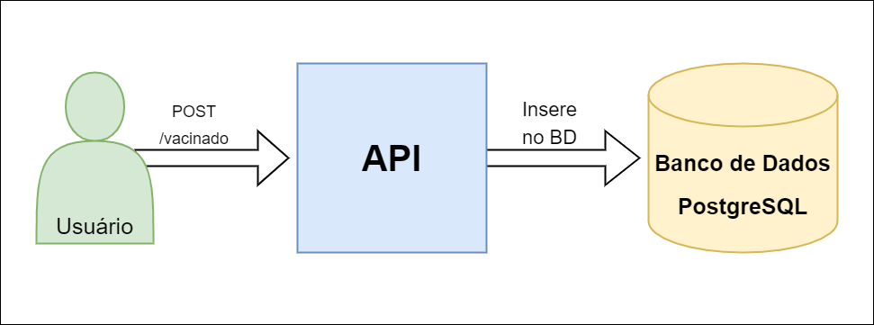

# sistema-vacina

## Descrição

O projeto sistema-vacina é uma API REST para registro de cidadãos vacinados feito em Java com Spring.

## Como o projeto foi feito

O projeto sistema-vacina foi feito com o Maven, uma ferramenta de gestão de dependências que automatiza os processos de obtenção de dependências e de compilação de projetos Java. O Maven criou um arquivo de configuração pom.xml (Project Object Model), no qual foi informado as dependências do projeto e a forma com que desejamos que o mesmo fosse compilado, utilizando Java 8 e Spring Boot, framework que facilita  as configurações iniciais do projeto, trazendo uma instância do Tomcat, aplicação que atua como um web-server para o projeto.

## Banco de dados utilizado e sua configuração

Foi usado como banco de dados o PostgreSQL, por ser um banco de dados open-source, gratuito e de fácil uso. Essa base de dados foi configurada com sua respectiva url no arquivo “application.properties”, encontrado no diretório “src/main/resources”. Na minha base de dados, criei uma tabela que armazenaria os dados de pessoas registradas, sendo o id um serial primary key, o nome um charvar, o email um charvar, o cpf um charvar e o data_nascimento um date.

## Model

Em primeiro lugar, criei uma classe chamada “VacinadoModel”, que seria a entidade Model da aplicação, focada em abstrair uma pessoa vacinada que futuramente seria registrada na base de dados. Seus atributos são um Integer “id” (a identificação do objeto, sendo a primary key da tabela da base de dados), uma String “nome”, uma String “e-mail”, uma String “cpf”, e uma String “dataNascimento”, cada um com seus respectivos getters e setters para a manipuação dos objetos instanciados.

## Repository

Em segundo lugar, criei uma interface responsável por fazer o acesso ao banco de dados, a Repository que herda a CrudRepository, uma interface genérica que traz consigo as operações do SpringData, que recebeu como parâmetros o nosso modelo de cidadão vacinado, oVacinadoModel, e o tipo da nossa identificação de cada usuário, que é nossa primary key “id”, que é Integer.

> O SpringData, um projeto Spring que tem como objetivo facilitar o acesso ao banco de dados traz consigo diversos métodos já implementados, como por exemplo o count, o delete, o existsById e o save, que foi o método utilizado para salvar um vacinado, registrando-o no banco de dados.

## Service

Foi criado então, um serviço chamado “VacinadoService”, parte do projeto responsável por ter um  método que foi criado para salvar o vacinado no banco de dados utilizando o método save do CrudRepository do SpringData.

## Controller

Na última etapa, criei o Controller de anotação da aplicação, parte responsável por registrar o que seria feito quando fosse feita uma requisição do tipo “POST” ao sistema. No caso, quando a requisição fosse feita em “/vacinado”, seria chamado o método criado no nosso service, salvando nosso vacinado no banco de dados.

## Diagrama

> Nesse diagrama, podemos ver como funciona o sistema. O usuário faz uma requisição do tipo POST à API, utilizando a url "/vacinado", e a API insere a pessoa registrada pelo usuário no banco de dados.

## Tecnologias
- Spring Boot

- Spring Web

- Spring Data

- Spring Validation
